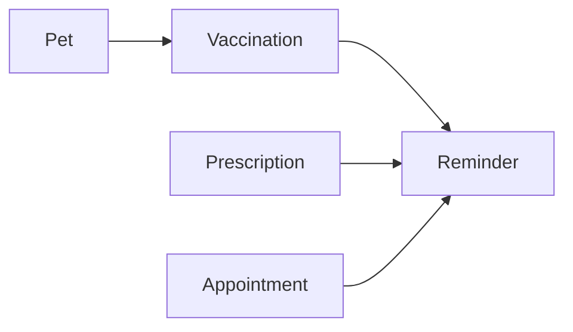

# 🗄️ Database Schema Documentation - VetSystem

> **Base de Datos**: PostgreSQL  
> **ORM**: Prisma  
> **Generado**: 2025-09-03  

---

## 📋 Índice

1. [Arquitectura General](#arquitectura-general)
2. [Modelos Core](#modelos-core)
3. [Relaciones Principales](#relaciones-principales)
4. [Diagramas de Entidades](#diagramas-de-entidades)
5. [Índices y Optimizaciones](#índices-y-optimizaciones)
6. [Patrones de Uso](#patrones-de-uso)
7. [Consideraciones de Rendimiento](#consideraciones-de-rendimiento)

---

## 🏗️ Arquitectura General

El sistema está diseñado con 7 módulos principales interconectados:

```
┌─────────────────────────────────────────────────────────────┐
│                        VETSYSTEM                            │
│                    Database Schema                          │
└─────────────────────────────────────────────────────────────┘
│
├── 👥 USUARIOS Y ROLES
│   ├── User (usuarios del sistema)
│   └── UserRole (ADMIN, VETERINARIAN, RECEPTIONIST)
│
├── 🏠 PROPIETARIOS Y MASCOTAS  
│   ├── Owner (propietarios - búsqueda por cédula)
│   ├── Pet (mascotas con ID interno)
│   └── PetWeight (historial de peso)
│
├── 📦 INVENTARIO INTELIGENTE
│   ├── ProductCategory (categorías)
│   ├── Product (productos base)
│   ├── ProductBatch (lotes con vencimientos)
│   └── StockMovement (movimientos de inventario)
│
├── 🩺 HISTORIALES MÉDICOS COMPLETOS
│   ├── MedicalRecord (consultas básicas)
│   ├── Anamnesis (historia clínica detallada)
│   ├── VitalSigns (signos vitales)
│   ├── SystemsReview (revisión por sistemas)
│   ├── Prescription (medicamentos recetados)
│   └── Vaccination (vacunas aplicadas)
│
├── 📅 SISTEMA DE CITAS
│   ├── Appointment (citas programadas)
│   └── AppointmentStatus/Type (estados y tipos)
│
├── 🔔 RECORDATORIOS
│   ├── Reminder (recordatorios personalizados)
│   └── ReminderType/Status (tipos y estados)
│
└── 💰 FACTURACIÓN
    ├── Service (servicios veterinarios)
    ├── Receipt (comprobantes)
    └── ReceiptItem (líneas de factura)
```

---

## 🎯 Modelos Core

### 1. **USUARIOS Y AUTENTICACIÓN** 👥

#### `User`
```prisma
model User {
  id           Int      @id @default(autoincrement())
  email        String   @unique                    // Login único
  passwordHash String                              // BCrypt hash
  name         String                              // Nombre completo
  role         UserRole                            // Rol del sistema
  phone        String?                             // Teléfono opcional
  active       Boolean  @default(true)             // Estado del usuario
  createdAt    DateTime @default(now())
  updatedAt    DateTime @updatedAt
}

enum UserRole {
  ADMIN         // Acceso total al sistema
  RECEPTIONIST  // Propietarios, mascotas, citas
  VETERINARIAN  // Historiales médicos, inventario médico
}
```

**🔑 Relaciones Clave:**
- `medicalRecords[]` - Historiales creados
- `appointments[]` - Citas asignadas/creadas
- `stockMovements[]` - Movimientos de inventario
- `reminders[]` - Recordatorios enviados/creados

---

### 2. **PROPIETARIOS Y MASCOTAS** 🏠🐕

#### `Owner` - Búsqueda Principal por Cédula
```prisma
model Owner {
  id                   Int    @id @default(autoincrement())
  name                 String                     // Nombre completo
  identificationNumber String @unique             // CÉDULA - CAMPO CLAVE 🔍
  phone                String?                    // Contacto principal
  email                String?                    // Email opcional
  address              String?                    // Dirección completa
  notes                String?                    // Observaciones
  createdAt            DateTime @default(now())
  updatedAt            DateTime @updatedAt

  @@index([identificationNumber])  // ÍNDICE PRINCIPAL
}
```

#### `Pet` - Mascotas con ID Interno
```prisma
model Pet {
  id           Int       @id @default(autoincrement())
  internalId   String    @unique                   // P001, P002... - ID VISIBLE 🏷️
  name         String                              // Nombre de la mascota
  species      Species                             // DOG, CAT, BIRD, etc.
  breed        String?                             // Raza específica
  birthDate    DateTime?                           // Fecha de nacimiento
  gender       Gender    @default(UNKNOWN)         // MALE, FEMALE, UNKNOWN
  color        String?                             // Color descriptivo
  microchip    String?                             // Número de microchip
  photoUrl     String?                             // URL de foto (opcional)
  currentWeight Decimal?  @db.Decimal(5, 2)       // Peso actual en kg
  ownerId      Int                                 // FK a Owner
  qrCode       String?   @unique                   // QR Code futuro (UUID)
  notes        String?                             // Observaciones especiales
  active       Boolean   @default(true)           // Estado activo
  createdAt    DateTime  @default(now())
  updatedAt    DateTime  @updatedAt

  @@index([internalId])  // Búsqueda rápida
  @@index([ownerId])     // Filtrado por propietario
  @@index([qrCode])      // Búsqueda por QR (futuro)
}
```

#### `PetWeight` - Seguimiento de Peso
```prisma
model PetWeight {
  id              Int      @id @default(autoincrement())
  petId           Int                                  // FK a Pet
  weight          Decimal  @db.Decimal(5, 2)          // Peso en kg
  measurementDate DateTime @db.Date                    // Fecha de medición
  recordedBy      Int                                  // FK a User
  notes           String?                              // Observaciones

  @@index([petId, measurementDate])  // Historial cronológico
}
```

**🔄 Flujo de Búsqueda Principal:**
```
Cédula → Owner → Pet[] → Historial Completo
```

---

### 3. **INVENTARIO INTELIGENTE** 📦

#### `Product` - Productos Base
```prisma
model Product {
  id                   Int             @id @default(autoincrement())
  name                 String                              // Nombre comercial
  categoryId           Int?                                // FK a ProductCategory
  description          String?                             // Descripción completa
  unitType             UnitType                            // ML, MG, TABLETS, etc.
  unitPrice            Decimal?        @db.Decimal(10, 2)  // Precio por unidad
  currentStock         Int             @default(0)         // Stock actual total
  minimumStock         Int             @default(5)         // Mínimo requerido
  maximumStock         Int?                                // Máximo recomendado
  requiresPrescription Boolean         @default(false)     // Requiere receta médica
  supplier             String?                             // Proveedor principal
  
  // CARACTERÍSTICA CLAVE: Control de lotes opcional
  trackBatches         Boolean         @default(false)     // ¿Controlar lotes FIFO?
  
  active               Boolean         @default(true)
  createdAt            DateTime        @default(now())
  updatedAt            DateTime        @updatedAt

  @@index([name])        // Búsqueda por nombre
  @@index([categoryId])  // Filtrado por categoría
}
```

#### `ProductBatch` - Control Avanzado de Lotes
```prisma
model ProductBatch {
  id             Int         @id @default(autoincrement())
  productId      Int                                    // FK a Product
  batchNumber    String                                 // Lote del proveedor
  expirationDate DateTime?   @db.Date                   // Fecha de vencimiento
  quantity       Int                                    // Cantidad en lote
  costPerUnit    Decimal?    @db.Decimal(10, 4)        // Costo real de compra
  supplier       String?                                // Proveedor específico
  receivedDate   DateTime    @default(now()) @db.Date   // Fecha de recepción
  status         BatchStatus @default(ACTIVE)           // ACTIVE, EXPIRED, RECALLED

  @@index([expirationDate])      // Alertas de vencimiento
  @@index([productId, status])   // Filtrado eficiente
}
```

#### `StockMovement` - Trazabilidad Completa
```prisma
model StockMovement {
  id            Int            @id @default(autoincrement())
  productId     Int                                      // FK a Product
  batchId       Int?                                     // FK a ProductBatch (opcional)
  movementType  MovementType                             // IN, OUT, ADJUSTMENT, etc.
  quantity      Int                                      // + entrada, - salida
  reason        String?                                  // Motivo del movimiento
  referenceType ReferenceType                            // MEDICAL_RECORD, SALE, etc.
  referenceId   Int?                                     // ID de referencia
  costPerUnit   Decimal?       @db.Decimal(10, 4)       // Costo unitario
  performedBy   Int                                      // FK a User
  movementDate  DateTime       @default(now())           // Timestamp

  @@index([productId, movementDate])    // Historial por producto
  @@index([referenceType, referenceId]) // Trazabilidad
}
```

**🔄 Flujo de Inventario:**
```
Prescripción → Verificar Stock → Seleccionar Lote (FIFO) → StockMovement → Actualizar Stock
```

---

### 4. **HISTORIALES MÉDICOS COMPLETOS** 🩺

#### `MedicalRecord` - Consulta Base
```prisma
model MedicalRecord {
  id             Int      @id @default(autoincrement())
  petId          Int                                    // FK a Pet
  appointmentId  Int?                                   // FK a Appointment (opcional)
  veterinarianId Int                                    // FK a User (veterinario)
  visitDate      DateTime @db.Date                      // Fecha de consulta
  visitTime      DateTime? @db.Time                     // Hora de consulta
  reasonForVisit String                                 // Motivo principal
  symptoms       String?                                // Síntomas observados
  diagnosis      String?                                // Diagnóstico
  treatment      String?                                // Tratamiento aplicado
  weight         Decimal? @db.Decimal(5, 2)            // Peso en consulta
  temperature    Decimal? @db.Decimal(4, 2)            // Temperatura corporal
  notes          String?                                // Observaciones generales
  followUpDate   DateTime? @db.Date                     // Próximo seguimiento
  createdAt      DateTime @default(now())
  updatedAt      DateTime @updatedAt

  @@index([petId, visitDate])           // Historial cronológico
  @@index([veterinarianId, visitDate])  // Consultas por veterinario
}
```

#### `Anamnesis` - Historia Clínica Detallada
```prisma
model Anamnesis {
  id                   Int      @id @default(autoincrement())
  medicalRecordId      Int      @unique                 // 1:1 con MedicalRecord
  
  // Historia de Desparasitación
  lastDewormingDate    DateTime? @db.Date              // Última desparasitación
  dewormingFrequency   String?                         // "Cada 3 meses"
  dewormingProducts    String?                         // "Drontal, Bravecto"
  
  // Enfermedades y Tratamientos Previos
  previousIllnesses    String?                         // Enfermedades anteriores
  chronicConditions    String?                         // Condiciones crónicas
  allergies            String?                         // Alergias conocidas
  surgicalHistory      String?                         // Cirugías previas
  previousTreatments   String?                         // Tratamientos anteriores
  currentMedications   String?                         // Medicamentos actuales
  
  // Alimentación
  feedType             String?                         // "Concentrado", "Casera", "Mixta"
  feedBrand            String?                         // Marca de alimento
  feedingSchedule      String?                         // "2 veces al día"
  specialDiet          Boolean   @default(false)       // ¿Dieta especial?
  dietDetails          String?                         // Detalles de la dieta
  appetiteChanges      String?                         // Cambios en apetito
  
  // Historia Reproductiva
  reproductiveStatus   String?                         // "Entero", "Castrado"
  castrationDate       DateTime? @db.Date              // Fecha de castración
  lastHeatDate         DateTime? @db.Date              // Último celo (hembras)
  pregnancyHistory     Int?      @default(0)           // Número de gestaciones
  lastBirthDate        DateTime? @db.Date              // Último parto
  
  // Comportamiento y Actividad
  behaviorChanges      String?                         // Cambios de comportamiento
  activityLevel        String?                         // "Alta", "Media", "Baja"
  exerciseRoutine      String?                         // Rutina de ejercicio
  sleepPatterns        String?                         // Patrones de sueño
  
  // Ambiente
  housingType          String?                         // "Casa", "Apartamento", "Finca"
  outdoorAccess        Boolean   @default(false)       // ¿Acceso al exterior?
  otherPets            String?                         // Otras mascotas
  
  // Historial Veterinario
  lastVetVisit         DateTime? @db.Date              // Última consulta veterinaria
  reasonLastVisit      String?                         // Motivo de la última consulta
  
  createdAt            DateTime  @default(now())
  updatedAt            DateTime  @updatedAt
}
```

#### `VitalSigns` - Signos Vitales y Examen Físico
```prisma
model VitalSigns {
  id                   Int      @id @default(autoincrement())
  medicalRecordId      Int      @unique                 // 1:1 con MedicalRecord
  
  // Signos Vitales Básicos
  heartRate            Int?                             // Frecuencia cardíaca (ppm)
  respiratoryRate      Int?                             // Frecuencia respiratoria (rpm)
  temperature          Decimal? @db.Decimal(4, 2)      // Temperatura (°C)
  weight               Decimal? @db.Decimal(5, 2)      // Peso (kg)
  
  // Estado Físico General
  bodyConditionScore   Int?                             // Escala 1-5
  hydrationStatus      String?                          // "Normal", "Leve", "Moderada", "Severa"
  mentalStatus         String?                          // "Alerta", "Deprimido", "Letárgico"
  postureGait          String?                          // Descripción de postura y marcha
  
  // Examen Cardiovascular
  heartSounds          String?                          // "Normal", "Soplo", "Arritmia"
  pulseQuality         String?                          // "Fuerte", "Débil", "Filiforme"
  mucousMembranes      String?                          // "Rosadas", "Pálidas", "Cianóticas"
  capillaryRefillTime  String?                          // "< 2 segundos", "> 3 segundos"
  
  // Ganglios Linfáticos
  lymphNodes           String?                          // "Normales", "Aumentados", "Duros"
  lymphNodeDetails     String?                          // Descripción detallada
  
  // Estado General
  alertness            String?                          // "Alerta", "Letárgico", "Estuporoso"
  temperament          String?                          // "Dócil", "Nervioso", "Agresivo"
  painLevel            String?                          // "Ausente", "Leve", "Moderado", "Severo"
  
  createdAt            DateTime @default(now())
  updatedAt            DateTime @updatedAt
}
```

#### `SystemsReview` - Revisión por Sistemas
```prisma
model SystemsReview {
  id                   Int      @id @default(autoincrement())
  medicalRecordId      Int      @unique                 // 1:1 con MedicalRecord
  
  // Sistema Tegumentario (Piel y Pelo)
  skinCondition        String?                          // "N", "AN", "NE"
  skinFindings         String?                          // Descripción detallada
  coatQuality          String?                          // "Brillante", "Opaco", "Graso"
  skinLesions          String?                          // Descripción de lesiones
  
  // Sistema Respiratorio
  respiratorySystem    String?                          // "N", "AN", "NE"
  lungSounds           String?                          // "Normales", "Crepitantes"
  breathingPattern     String?                          // "Normal", "Disnea", "Taquipnea"
  coughPresent         Boolean  @default(false)         // ¿Presenta tos?
  nasalDischarge       String?                          // "Ausente", "Seroso", "Purulento"
  
  // Sistema Digestivo
  digestiveSystem      String?                          // "N", "AN", "NE"
  oralExamination      String?                          // Estado dental y oral
  abdominalPalpation   String?                          // "Normal", "Distendido"
  intestinalSounds     String?                          // "Normales", "Aumentados"
  
  // Sistema Genitourinario
  genitourinarySystem  String?                          // "N", "AN", "NE"
  kidneyPalpation      String?                          // "Normal", "Aumentado"
  bladderPalpation     String?                          // "Normal", "Distendida"
  genitalExamination   String?                          // Examen genital
  urination            String?                          // "Normal", "Poliuria", "Disuria"
  
  // Sistema Musculoesquelético
  musculoskeletalSystem String?                         // "N", "AN", "NE"
  jointMobility         String?                         // "Normal", "Limitada"
  muscleCondition       String?                         // "Normal", "Atrofia"
  gaitAssessment        String?                         // "Normal", "Cojera"
  spinalPalpation       String?                         // Palpación espinal
  
  // Sistema Nervioso
  nervousSystem        String?                          // "N", "AN", "NE"
  mentalState          String?                          // "Normal", "Deprimido"
  reflexesAssessment   String?                          // "Normales", "Aumentados"
  coordinationTest     String?                          // "Normal", "Ataxia"
  
  // Órganos de los Sentidos
  eyeExamination       String?                          // "Normal", "Conjuntivitis"
  earExamination       String?                          // "Normal", "Otitis"
  
  // Observaciones Generales
  generalObservations  String?                          // Observaciones adicionales
  additionalFindings   String?                          // Hallazgos adicionales
  
  createdAt            DateTime @default(now())
  updatedAt            DateTime @updatedAt
}
```

#### `Prescription` - Medicamentos Recetados
```prisma
model Prescription {
  id               Int    @id @default(autoincrement())
  medicalRecordId  Int                                  // FK a MedicalRecord
  productId        Int                                  // FK a Product
  quantity         Decimal @db.Decimal(8, 2)           // Cantidad recetada
  dosage           String                               // "1 tableta cada 8 horas"
  frequency        String?                              // "Cada 8 horas"
  duration         String?                              // "7 días"
  instructions     String?                              // Instrucciones especiales
  startDate        DateTime @default(now()) @db.Date   // Fecha de inicio
  endDate          DateTime? @db.Date                   // Fecha de finalización

  @@index([medicalRecordId])  // Prescripciones por consulta
}
```

---

### 5. **SISTEMA DE CITAS** 📅

#### `Appointment`
```prisma
model Appointment {
  id              Int             @id @default(autoincrement())
  petId           Int                                      // FK a Pet
  ownerId         Int                                      // FK a Owner
  veterinarianId  Int?                                     // FK a User (opcional)
  appointmentDate DateTime        @db.Date                 // Fecha de cita
  appointmentTime DateTime        @db.Time                 // Hora de cita
  durationMinutes Int             @default(30)             // Duración estimada
  appointmentType AppointmentType @default(CONSULTATION)   // CONSULTATION, VACCINATION, etc.
  status          AppointmentStatus @default(SCHEDULED)    // SCHEDULED, COMPLETED, etc.
  reason          String?                                  // Motivo de la cita
  notes           String?                                  // Observaciones
  createdBy       Int                                      // FK a User (quien creó)
  createdAt       DateTime        @default(now())
  updatedAt       DateTime        @updatedAt

  @@index([appointmentDate, appointmentTime])  // Calendario
  @@index([veterinarianId, appointmentDate])   // Agenda por veterinario
}
```

---

### 6. **RECORDATORIOS** 🔔

#### `Reminder`
```prisma
model Reminder {
  id           Int           @id @default(autoincrement())
  petId        Int                                    // FK a Pet
  ownerId      Int                                    // FK a Owner
  reminderType ReminderType                          // MEDICATION, VACCINATION, etc.
  title        String                                 // Título del recordatorio
  message      String                                 // Mensaje completo
  dueDate      DateTime      @db.Date                 // Fecha límite
  dueTime      DateTime?     @db.Time                 // Hora específica (opcional)
  priority     Priority      @default(MEDIUM)         // LOW, MEDIUM, HIGH
  status       ReminderStatus @default(PENDING)       // PENDING, SENT, COMPLETED
  method       ContactMethod @default(WHATSAPP)       // WHATSAPP, EMAIL, PHONE
  sentDate     DateTime?                              // Cuándo se envió
  sentBy       Int?                                   // FK a User (quien envió)
  createdBy    Int                                    // FK a User (quien creó)
  createdAt    DateTime      @default(now())

  @@index([dueDate, status])      // Recordatorios pendientes
  @@index([petId, reminderType])  // Recordatorios por mascota/tipo
}
```

---

### 7. **FACTURACIÓN** 💰

#### `Receipt` - Comprobantes
```prisma
model Receipt {
  id             Int           @id @default(autoincrement())
  receiptNumber  String        @unique                 // VET001, VET002...
  petId          Int                                   // FK a Pet
  ownerId        Int                                   // FK a Owner
  veterinarianId Int?                                  // FK a User (opcional)
  issueDate      DateTime      @db.Date                // Fecha de emisión
  totalAmount    Decimal       @db.Decimal(10, 2)     // Monto total
  paymentMethod  PaymentMethod @default(CASH)          // CASH, CARD, TRANSFER
  paymentStatus  PaymentStatus @default(PAID)          // PAID, PENDING, PARTIAL
  notes          String?                               // Observaciones
  createdBy      Int                                   // FK a User
  createdAt      DateTime      @default(now())

  @@index([issueDate])        // Búsqueda por fecha
  @@index([receiptNumber])    // Búsqueda por número
}
```

#### `ReceiptItem` - Líneas de Factura
```prisma
model ReceiptItem {
  id          Int      @id @default(autoincrement())
  receiptId   Int                                    // FK a Receipt
  productId   Int?                                   // FK a Product (opcional)
  description String                                 // Descripción del ítem
  quantity    Decimal  @db.Decimal(8, 2)            // Cantidad
  unitPrice   Decimal  @db.Decimal(10, 2)           // Precio unitario
  totalPrice  Decimal  @db.Decimal(10, 2)           // Precio total línea
  itemType    ItemType @default(SERVICE)             // PRODUCT, SERVICE, MEDICATION
}
```

---

## 🔄 Relaciones Principales

### **Flujo Central: Cédula → Owner → Pet → Historia**
```mermaid
graph LR
    A[Cédula del Propietario] --> B[Owner]
    B --> C[Pet[]]
    C --> D[MedicalRecord[]]
    D --> E[Anamnesis]
    D --> F[VitalSigns]
    D --> G[SystemsReview]
    D --> H[Prescription[]]
```

### **Inventario Inteligente**
```mermaid
graph LR
    A[Product] --> B[ProductBatch[]]
    B --> C[StockMovement[]]
    C --> D[MedicalRecord]
    A --> E[Prescription]
```

### **Sistema de Recordatorios**


---

## 🔍 Índices y Optimizaciones

### **Índices Críticos para Rendimiento**

#### Búsquedas Principales:
```sql
-- Búsqueda por cédula (flujo principal)
CREATE INDEX idx_identification ON owners(identification_number);

-- Búsqueda por ID interno de mascota
CREATE INDEX idx_internal_id ON pets(internal_id);

-- QR Code futuro
CREATE INDEX idx_qr_code ON pets(qr_code);
```

#### Historiales Médicos:
```sql
-- Historial cronológico por mascota
CREATE INDEX idx_pet_visit_date ON medical_records(pet_id, visit_date);

-- Consultas por veterinario
CREATE INDEX idx_vet_visit_date ON medical_records(veterinarian_id, visit_date);
```

#### Inventario:
```sql
-- Productos por nombre (autocomplete)
CREATE INDEX idx_product_name ON products(name);

-- Lotes por vencimiento (alertas)
CREATE INDEX idx_expiration ON product_batches(expiration_date);

-- Movimientos por producto (historial)
CREATE INDEX idx_product_date ON stock_movements(product_id, movement_date);
```

#### Citas y Recordatorios:
```sql
-- Calendario de citas
CREATE INDEX idx_date_time ON appointments(appointment_date, appointment_time);

-- Recordatorios pendientes
CREATE INDEX idx_due_status ON reminders(due_date, status);
```

---

## 🎯 Patrones de Uso

### **1. Búsqueda Rápida por Cédula**
```sql
-- Flujo más común: 70% de las consultas
SELECT o.*, p.* FROM owners o 
JOIN pets p ON o.id = p.owner_id 
WHERE o.identification_number = '1234567890';
```

### **2. Historial Médico Completo**
```sql
-- Recuperar consulta con detalles completos
SELECT mr.*, a.*, vs.*, sr.*
FROM medical_records mr
LEFT JOIN anamnesis a ON mr.id = a.medical_record_id
LEFT JOIN vital_signs vs ON mr.id = vs.medical_record_id  
LEFT JOIN systems_review sr ON mr.id = sr.medical_record_id
WHERE mr.pet_id = ? ORDER BY mr.visit_date DESC;
```

### **3. Control de Stock FIFO**
```sql
-- Seleccionar lote más próximo a vencer (FIFO)
SELECT pb.* FROM product_batches pb
WHERE pb.product_id = ? AND pb.status = 'ACTIVE' AND pb.quantity > 0
ORDER BY pb.expiration_date ASC, pb.received_date ASC
LIMIT 1;
```

### **4. Dashboard con Estadísticas**
```sql
-- Métricas principales del dashboard
SELECT 
  (SELECT COUNT(*) FROM owners) as totalOwners,
  (SELECT COUNT(*) FROM pets WHERE active = true) as totalPets,
  (SELECT COUNT(*) FROM appointments WHERE appointment_date = CURRENT_DATE) as todayAppointments,
  (SELECT COUNT(*) FROM products WHERE current_stock <= minimum_stock) as lowStockProducts,
  (SELECT COUNT(*) FROM reminders WHERE status = 'PENDING') as pendingReminders;
```

---

## ⚡ Consideraciones de Rendimiento

### **Estrategias de Optimización**

1. **Particionamiento por Fecha** (Futuro)
   - `medical_records` por año
   - `appointments` por mes
   - `stock_movements` por trimestre

2. **Caché de Consultas Frecuentes**
   - Stats del dashboard (5 min TTL)
   - Lista de productos activos (15 min TTL)
   - Recordatorios del día actual (1 min TTL)

3. **Índices Compuestos Estratégicos**
   - `(pet_id, visit_date)` para historiales
   - `(product_id, movement_date)` para inventario
   - `(due_date, status)` para recordatorios

4. **Soft Deletes vs Hard Deletes**
   - Mascotas: `active = false` (mantener historial)
   - Productos: `active = false` (mantener referencias)
   - Usuarios: `active = false` (auditoría)

### **Límites y Escalabilidad**

- **Mascotas por Propietario**: Máximo recomendado 20
- **Consultas por Mascota**: Ilimitado (particionado)
- **Productos en Inventario**: Máximo recomendado 5,000
- **Citas Concurrentes**: Máximo 50/hora por veterinario

---

## 📊 Métricas y Monitoreo

### **Queries Críticos a Monitorear**
1. Búsqueda por cédula (< 50ms)
2. Carga de historial médico (< 200ms)  
3. Verificación de stock (< 30ms)
4. Dashboard stats (< 100ms)

### **Alertas de Integridad**
- Productos con stock negativo
- Lotes vencidos sin procesar
- Citas sin veterinario asignado
- Recordatorios sin enviar > 24h

---

## 🔄 Versionado del Schema

**Versión Actual**: 1.0  
**Última Actualización**: 2025-09-03  

### **Migraciones Pendientes**
- [ ] Índice GIN para búsqueda de texto completo en `notes`
- [ ] Particionamiento de `medical_records` por año
- [ ] Caché materializado para stats del dashboard
- [ ] Trigger para actualización automática de `current_weight` en pets

---

*Este documento es generado automáticamente desde el schema de Prisma. Para cambios, editar el archivo `prisma/schema.prisma` y regenerar la documentación.*